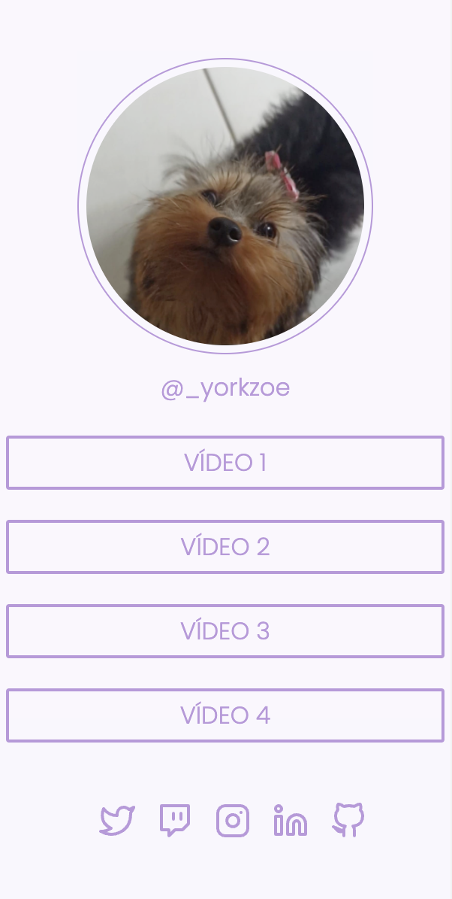
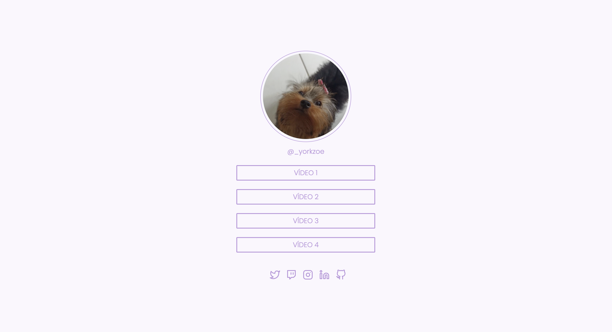

# social-tree-rocketseat

Desafio proposto no final do curso Discover da Rocketseat.
Criar uma página com uma lista de links (menu) que pode ser usada em perfis de redes sociais para direcionar o usuário para o local escolhido. 

## Tecnologias ##

HTML - Utilizei tags do HTML5.
CSS - O layout foi construído utilizando FlexBox. Modelo responsivo. 

## Link para visualização ##

[Social Tree](https://alesandraisla.github.io/social-tree-rocketseat/)

## Layout - Mobile e Desktop ##

     
    

